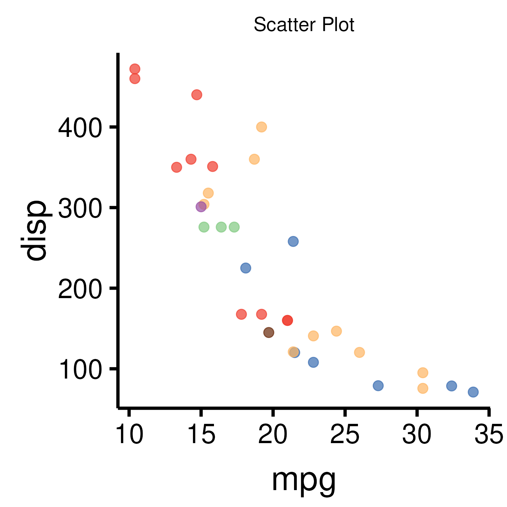

<!-- README.md is generated from README.Rmd. Please edit that file -->

# Custom Theme for Publication (thepubr)

<!-- badges: start -->
<!-- badges: end -->

The goal of thepubr is to custom theme, axis, font, size for publication output of ggplot2.
## Installation

You can install the development version of thepubr like so:

``` r
devtools::install_github("haihuilab/thepubr")
```
## Install fonts in Windows
We change the ggplot2 default `Arial` font to `HelveticaNeueLTStd-Roman` font. First, we install `HelveticaNeueLTStd-Roman.ttf` in windows or ubuntu from main folder.

## Example

This is a basic example which shows you how to solve a common problem:

``` r
library(thepubr)
## basic example code
# Examples
library(ggplot2)
library(gridExtra)
library(tidyverse)

scatter <- ggplot(mtcars, aes(mpg,disp,color=factor(carb))) + geom_point(size=3, alpha = 0.7) + labs(title="Scatter Plot")
g1 <- grid.arrange(scatter,(scatter + scale_color_publication() + theme_publication()),nrow = 1)
# Small
save_figure(g1, filename = "example_plot_small", size = "small_wide")

g2 <- grid.arrange((scatter + scale_color_publication() + theme_publication(base_size = 24)),nrow = 1)
# Medium
save_figure(g2, filename = "example_plot_medium", size = "medium", device = "png")

bar <- ggplot(mtcars, aes(factor(carb),fill = factor(carb))) + geom_bar(alpha = 0.7) + labs(title = "Bar Plot")
# grid.arrange(bar,(bar + scale_color_publication(alpha = 0.8) + theme_publication()),nrow = 1)
g3 <- grid.arrange((bar + scale_color_publication() + theme_publication(base_size = 48)),nrow = 1)
# large
save_figure(g3, filename = "example_plot_large", size = "large")

```

What is special about using `README.Rmd` instead of just `README.md`?
You can include R chunks like so:

``` r
summary(cars)
#>      speed           dist       
#>  Min.   : 4.0   Min.   :  2.00  
#>  1st Qu.:12.0   1st Qu.: 26.00  
#>  Median :15.0   Median : 36.00  
#>  Mean   :15.4   Mean   : 42.98  
#>  3rd Qu.:19.0   3rd Qu.: 56.00  
#>  Max.   :25.0   Max.   :120.00
```

You’ll still need to render `README.Rmd` regularly, to keep `README.md`
up-to-date. `devtools::build_readme()` is handy for this. You could also
use GitHub Actions to re-render `README.Rmd` every time you push. An
example workflow can be found here:
<https://github.com/r-lib/actions/tree/v1/examples>.

You can also embed plots, for example:



In that case, don’t forget to commit and push the resulting figure
files, so they display on GitHub and CRAN.
